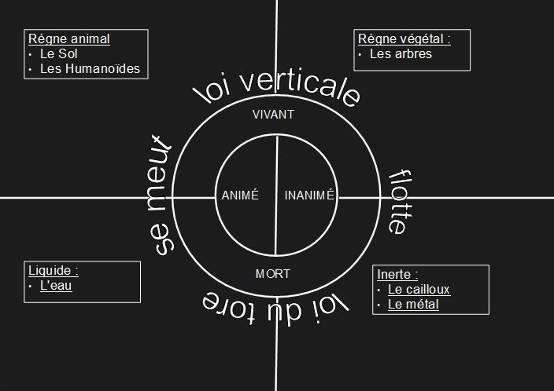

::: title Généralités 2
:::

::: container
# Généralités

Tout ce qui n'est pas précisé dans l'encyclopédie est supposé identique à la planète Terre.

Matière
-------

L'univers est intégralement composé de matière. Celle-ci est vivante ou morte, (à l'origine toute matière était vivante). Cette matière, qu'elle soit vivante ou morte, peut être soit animée soit inanimée[^1].

Ces quatres catégories permettent la compréhension de toute matière dans l'univers.

En fonction de la catégorie dans laquelle la matière se situe, elle sera soumise à deux **lois** différentes et à des intensités différentes: **loi verticale** pour le vivant et **loi du tore** pour la matière morte. Ces lois sont dites **rapides** pour la matière animée et **lentes** pour la matière inanimée.

[^1]: Il n'existe en réalité aucune matière inanimée, elle en a seulement l'air à une échelle de temps raisonnable. La matière désignée par inanimée se déplace en réalité très lentement suivant la loi qu'elle suit.

Espace
------

L'univers possède un référenciel privilégié qui est le centre du tore, ou parfois le point de gravité. Lorsqu'on parle de mouvement ou de position, sauf contre-indication, c'est par rapport au centre du tore.

Temps
-----

Le temps est une notion qui n'a pas de début. L'univers est infiniment vieux, mais son état était infiniment identique jusqu'aux événements traités dans cette encyclopédie.

Le temps se déroule de manière linéaire et continue.

La plus grande division du temps est le [cycle gravitationnel](../Généralités/loi_verticale.md#gravidsc).
:::