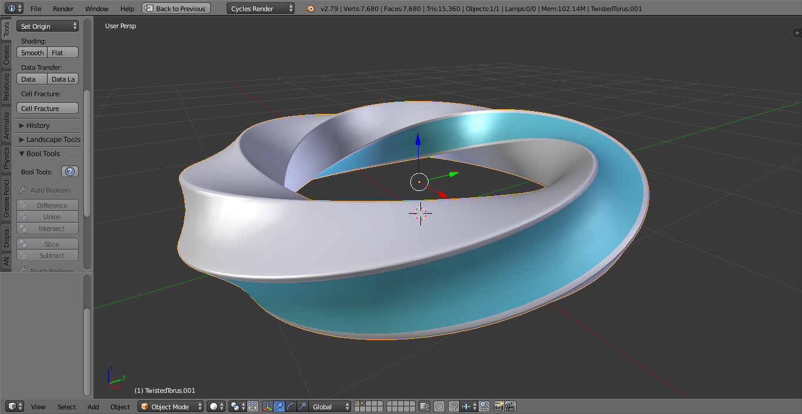

# Planète

## Qu'est-ce-que la planète *planète*?

La Planète, est celle qui définit ce qu'est une planète :

- sa forme
- ses lois physiques
- les matériaux qui la composent
- ...

La planète est en forme de tore. Pour se repérer :

- Un tore est formé par la révolution d'un cercle
- Ce cercle possède un centre, et les centres de tous ces cercles forment un courbe, la courbe des endroits les plus innaccessible depuis la surface.

### Gravité
La gravité est telle que où que l'on se trouve à sa surface, le torus nous attire à la fois vers le centre du cercle de révolution et vers le centre de gravité du tore entier. Donc, lorsqu'on est situé sur la partie extérieure du tore, l'attraction gravitationnelle générée par le centre du cercle de révolution s'ajoute à celle générée par l'autre côté du tôre (plus faible). La face intérieure connaît une attraction gravitationelle plus faible, ce qui rend l'environnement moins hostile

### Structure
Le tore est composé d'une matière à la fois liquide et solide. Celle-ci acquiert des propriétés différentes au cours du temps, notamment en terme de volume. Aussi Le tore, par la répartition de cette matière aux propriétés pentastructurelles, se déforme au fur et à mesure du temps dans une forme de tore "twisté".

