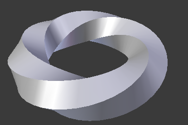

# Planète

## Qu'est-ce-que la planète *planète*?

La Planète, est celle qui définit ce qu'est une planète :

- une structure
- la matière qui la compose
- les lois physiques qui y règnent

### Structure
Le tore est composé d'une matière à la fois liquide et solide. Celle-ci acquiert des propriétés différentes au cours du temps, notamment en terme de volume. Aussi Le tore, par la répartition de cette matière aux propriétés pentastructurelles, se déforme au fur et à mesure du temps dans une forme de tore "twisté".

### Matière
La planète racine est composée de plusieurs matières très différentes dans leur nature.

* **Slime**: La slime est continue. En effet, elle n'est pas composée par d'autres éléments, comme des particules ou des atomes, mais est divisible à l'infini, sans que ses propriétés s'en trouvent changées.

     Cette matière est solide-liquide, à la manière de la moutarde. Aussi ses propriétés sont chroniques, c'est à dire qu'elles changent au fil du temps. Ce changement est accéléré par la profondeur du matériau.

     Aussi, elle ne rentre pas dans le champ gravitationnel, et échappe à toute interaction de ce type.

     Elle est soumise à des marrées, qui font varier l'état plus ou moins solide-liquide de la slime.

* **Iskav**: La seconde matière est complètement solide. Elle ne se situe qu'en surface, et permet au tore de disposer d'une surface rigide. Contrairement à l'autre composante du tore, celle-ci ne peut se diviser infiniment.

    Sa forme inséquable est un gravitrol, autrement dit un porteur de gravité. C'est donc par cette matière que la gravité est présente dans le tore, car la première ne "conduit" pas la gravitation.

### Lois Physiques

La loi physique principale qui concerne cette planète est la présence de propriétés chroniques du slilme en profondeur. En effet celui-ci voit sa propriété de volume son état varier au fur et à mesure du temps avec les marées, mais aussi en fonction de la profondeur.

En effet, le volume et l'état liquide du slime, augmentent avec la profondeur.

Cependant, parmi les zones à dominante liquide (vers le centre), des poches de slime solide peuvent survenir, et ce réciproquement.

.png")
